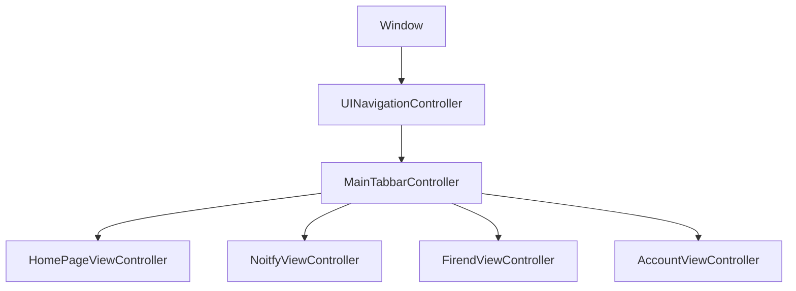
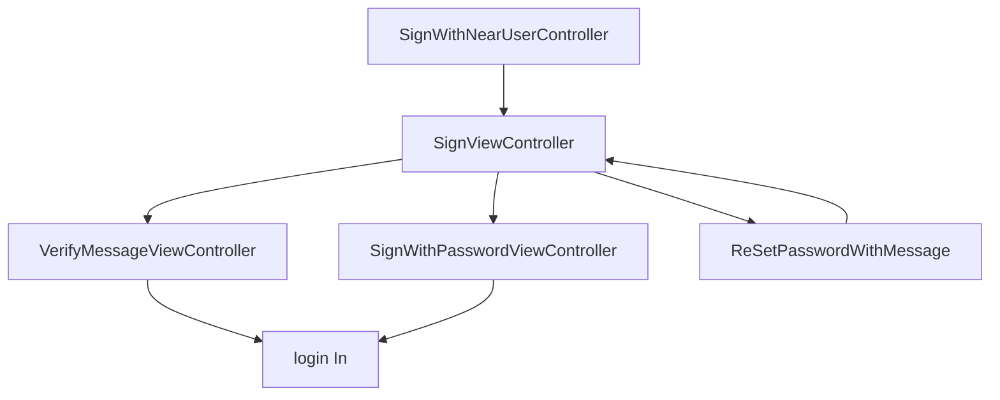
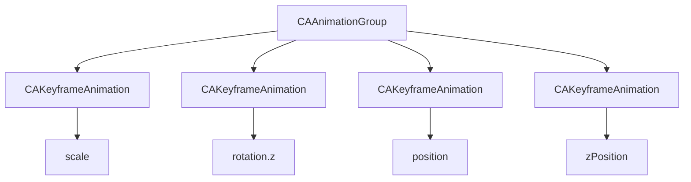

[TOC]

# DouYin_OC Project

## Introduce
<b>

> DouYin_OC is a Xcode Project,which is imitate DouYin.app,structure by Objective-C and Swift language. It is divided to three part.

>The first part is UI design,in this part, we use **UIKit** , **AVFoundation** and **Masonry**  ,to create our own view.moreover, we use **CoreAnimation** to custom our own animation load view and transition style,we also use **MBProgressHUD** and **HWPanModal** to custom our own pop-up view,we also use **RSSwizzle** package to enclosure swizzle method 

>The second part is Model design,in this part,we use **NSUserDefaults** and **plist** to achieve our Persistent Storage logic , also we use **JSONModel** package to define our own model,which will be used in NetWork Json parsing

>The third part is Network design,in this part, we use **AFNetworking** package to enclosure our own networkt logic  "NetWorkHelper" .moreover, we use **Socket.IO** package to enclosure our own socket connection logic "PDSocketManager",we also use **NSOperation** and **NSURLSessionTaskDelegate** to package download video logic

>The fourth part is cache design,in this part , we use **NSCache** and **NSFileManager** to package our own cache logic,we can use it to realize video cache or image cache
</b>


## UI Design

### 1.0 View Design
```ruby
pod 'Masonry'
pod 'MBProgressHUD'
pod 'HWPanModal'
```
#### 1.0.1 RootController
```objective-C
_window = [[UIWindow alloc]initWithFrame:[[UIScreen mainScreen] bounds]];
MainTabbarController *controller = [[MainTabbarController alloc] init];
UINavigationController *RootController = [[UINavigationController alloc] initWithRootViewController:controller];
[RootController setNavigationBarHidden:YES];
[_window setRootViewController:RootController];
[_window makeKeyAndVisible];
```
+ we use window to initialize rootviewcontroller
+ the rootcontroller is inherit form UINavigationController
+ the UINavigationController is initialize by MainTabbarController,which is inherit form UITabViewController
<center>



<p style="font-size:9pt">  1-1 the relation in viewcontrollers

</center>

#### 1.0.2 SignViewController
+ SignViewController : the main controller for sign in,in this controller , user can enter to other controller , the specific style is shown in the following figure 1-2
<center>

<p style="font-size:9pt">  1-2 specific style for SignViewController
</center>

<p style="font-size:9pt"> Note: The picture is from iphone 13

****

+ SignWithNearUserController:the controller for sign with recent user , if user want to sign with new user, he can click down button to  SignViewController, the specific style is shown in the following figure 1-3
<center>

<p style="font-size:9pt">  1-3 specific style for SignWithNearUserController
</center>

<p style="font-size:9pt"> Note: The picture is from iphone 13

***

+ VerifyMessageViewController:the controller for verify message, if user choice to sign with phone message , he will enter his phonenumber in SignViewController, than the phonenumber will be send to server,and server will send a message to user's phone,in the same time,server will send the real verify number to client. so, we just only add a logic to verify the number which input by user is it correct.the specific style is shown in the following figure 1-4
<center>

<p style="font-size:9pt">  1-4 specific style for VerifyMessageViewController
</center>

<p style="font-size:9pt"> Note: The picture is from iphone 13

****


+ SignWithPasswordViewController:the controller for sign with password,we not only provide to user sign with phone message,but also provide sign with password.the specific style is shown in the following figure 1-5
<center>

<p style="font-size:9pt">  1-5 specific style for SignWithPasswordViewController
</center>

<p style="font-size:9pt"> Note: The picture is from iphone 13

****

+ ReSetPasswordWithMessage:the controller for reset user's password , if user forget his password , he can use phonenumber to send a verify message to his phone, so that he can reset his password.the specific style is shown in the following figure 1-6

<center>

<p style="font-size:9pt">  1-6 specific style for ReSetPasswordWithMessage
</center>

<p style="font-size:9pt"> Note: The picture is from iphone 13

****

<center>



<p style="font-size:9pt">  1-7 the relation in signviewcontrollers

</center>

#### FirendViewController
>Waiting for replenishment

#### NoitfyViewController
>Waiting for replenishment

#### HomePageViewController
>Waiting for replenishment

#### AccountViewController
>Waiting for replenishment

### 2.0 Animation and transition Design
#### 2.0.1 LoadView
The loading view is a feature of the app view, which allows users to enjoy animation while waiting,therefore,we use core animation to custom our own keyframe animation

```objective-C
/// add ketframe animation to red circle
-(void)AddCoreAnimationRed{
    CAAnimationGroup *group = [[CAAnimationGroup alloc] init];
    group.duration = 0.8f;
    group.removedOnCompletion = NO;
    group.fillMode = kCAFillModeForwards;
    group.timingFunction = [CAMediaTimingFunction functionWithName:kCAMediaTimingFunctionEaseOut];
    group.beginTime = CACurrentMediaTime();
    group.repeatCount = MAXFLOAT;
    
    CAKeyframeAnimation *keyanimation1 = [CAKeyframeAnimation animation];
    keyanimation1.keyPath = @"transform.scale";
    [keyanimation1 setValues:@[
        [NSNumber numberWithFloat:1.0],
        [NSNumber numberWithFloat:1.5],
        [NSNumber numberWithFloat:1.0],
        [NSNumber numberWithFloat:0.8],
        [NSNumber numberWithFloat:1.0]
    ]];
    
    CAKeyframeAnimation *keyanimation2 = [CAKeyframeAnimation animation];
    keyanimation2.keyPath = @"transform.rotation.z";
    [keyanimation2 setValues:@[
        [NSNumber numberWithFloat:0],
        [NSNumber numberWithFloat:M_PI / 2],
        [NSNumber numberWithFloat:0],
        [NSNumber numberWithFloat:-M_PI / 2],
        [NSNumber numberWithFloat:0],
    ]];
    
    
    CAKeyframeAnimation *keyanimaion3 = [CAKeyframeAnimation animation];
    keyanimaion3.keyPath = @"position";
    [keyanimaion3 setValues:@[
        [NSValue valueWithCGPoint:CGPointMake(2, 15)],
        [NSValue valueWithCGPoint:CGPointMake(8, 15)],
        [NSValue valueWithCGPoint:CGPointMake(14, 15)],
        [NSValue valueWithCGPoint:CGPointMake(8, 15)],
        [NSValue valueWithCGPoint:CGPointMake(2, 15)]
    ]];

    
    CAKeyframeAnimation *keyanimaion4 = [CAKeyframeAnimation animation];
    keyanimaion4.keyPath = @"zPosition";
    [keyanimaion4 setValues:@[
        @(99),
        @(99),
        @(99),
        @(1),
        @(99),
    ]];
    
    [group setAnimations:@[keyanimation1,keyanimation2,keyanimaion3,keyanimaion4]];
    
    [self.redCircle.layer addAnimation:group forKey:@"newanimation"];
}

/// add ketframe animation to blue circle
-(void)AddCoreAnimationBlue{
    CAAnimationGroup *group = [[CAAnimationGroup alloc] init];
    group.duration = 0.8f;
    group.removedOnCompletion = NO;
    group.timingFunction = [CAMediaTimingFunction functionWithName:kCAMediaTimingFunctionEaseOut];
    group.fillMode = kCAFillModeForwards;
    group.beginTime = CACurrentMediaTime();
    group.repeatCount = MAXFLOAT;
    
    CAKeyframeAnimation *keyanimation1 = [CAKeyframeAnimation animation];
    keyanimation1.keyPath = @"transform.scale";
    [keyanimation1 setValues:@[
        [NSNumber numberWithFloat:1.0],
        [NSNumber numberWithFloat:0.8],
        [NSNumber numberWithFloat:1.0],
        [NSNumber numberWithFloat:1.5],
        [NSNumber numberWithFloat:1.0],
    ]];
    
    CAKeyframeAnimation *keyanimation2 = [CAKeyframeAnimation animation];
    keyanimation2.keyPath = @"transform.rotation.z";
    [keyanimation2 setValues:@[
        [NSNumber numberWithFloat:0],
        [NSNumber numberWithFloat:-M_PI / 2],
        [NSNumber numberWithFloat:0],
        [NSNumber numberWithFloat:M_PI / 2],
        [NSNumber numberWithFloat:0]
    ]];
    
    CAKeyframeAnimation *keyanimaion3 = [CAKeyframeAnimation animation];
    keyanimaion3.keyPath = @"position";
    [keyanimaion3 setValues:@[
        [NSValue valueWithCGPoint:CGPointMake(14, 15)],
        [NSValue valueWithCGPoint:CGPointMake(8, 15)],
        [NSValue valueWithCGPoint:CGPointMake(2, 15)],
        [NSValue valueWithCGPoint:CGPointMake(8, 15)],
        [NSValue valueWithCGPoint:CGPointMake(14, 15)]
    ]];
    
    CAKeyframeAnimation *keyanimaion4 = [CAKeyframeAnimation animation];
    keyanimaion4.keyPath = @"zPosition";
    [keyanimaion4 setValues:@[
        @(99),
        @(1),
        @(99),
        @(99),
        @(99),
    ]];
    [group setAnimations:@[keyanimation1,keyanimation2,keyanimaion3,keyanimaion4]];
    [self.blueCircle.layer addAnimation:group forKey:@"newanimation"];
}
```

<center>

<p style="font-size:9pt">  2-1 specific style for ReSetPasswordWithMessage
</center>

<p style="font-size:9pt"> Note: The picture is from iphone 13

<center>



<p style="font-size:9pt">  1-7 the relation in CAAnimationGroup

</center>


#### 2.0.2 transition design
>Waiting for replenishment

## Model Design

### Persistent Storage
#### AppUserData
> the user data use NSUserDefaults to storage,here is origin code
```Objective-C
/// the all of user has been login
@property (nonatomic,strong) NSArray<ClientData *> <ClientData> *AllUser;

/// get current user,which has login in
+(ClientData *)GetCurrenUser;

/**
 * save user with a new user 
 * @param user the new user which will be added in user list
*/
+(void)SavCurrentUser:(ClientData *)user;

/**
 * Query whether the user is added to the list
 * @param user the user which is you want to query
*/
+(BOOL)AddNewUser:(ClientData *)user;

/**
 * get all of user you have been added
*/
+(AppUserData *)GetAllUser;

/**
 * get recent user
*/
+(ClientData *)GetNearstSignUser;

/**
 * login with recent user
*/
+(void)SignWithNearstUser;

/**
 * login with index
*/
+(void)SignWithUser:(NSInteger)newindex;

/**
 * remove user by index
 * @param index the user index
*/
+(void)RemoveUser:(NSInteger)index;
```

### JsonModel
>Waiting for replenishment

## NetWork Design

```ruby
pod 'AFNetWorking'
```

### 1.0 Network communication

#### 1.0.1 router design
> We will import the port docked from the backend into the project
```objective-C
/// network state notification
extern NSString *const NetworkStatesChangeNotification;

extern NSString *const NetworkDomain;

/// 请求地址
extern NSString *const BaseUrl;

/// 创建访客用户接口
extern NSString *const CreateVisitorPath;

//根据用户id获取用户信息
extern NSString *const GetUserByUsernamePath;
extern NSString *const GetUserByphoneNumberPath;
extern NSString *const GetUserByIDPath;
extern NSString *const SignInPath;
extern NSString *const SignInWithMessagePath;
extern NSString *const SignUpPath;
extern NSString *const SignUpMessageVerifyPath;
extern NSString *const ResetPasswordPath;
extern NSString *const ResetPasswordVerifyPath;

//搜索用户
extern NSString *const SearchClientPath;

//获取用户朋友列表
extern NSString *const GetFriendListDetialPath;

//获取用户粉丝列表
extern NSString *const GetFansListDetialPath;

//根据用户的id更新用户信息
extern NSString *const UpdateClientMessagePath;

// 根据用户ID更新头像和背景图
extern NSString *const UpdateClientImagePath;

//根据用户ID和对方ID更新关注和粉丝列表
extern NSString *const AddConcernPath;

//获取用户刷视频的主体推荐内容
extern NSString *const MainVideoPath;

//获取用户发布的短视频列表数据
extern NSString *const FindAwemePostByPagePath;
//获取用户喜欢的短视频列表数据
extern NSString *const FindAwemeFavoriteByPagePath;
//获取用户收藏的短视频列表数据
extern NSString *const FindAwemeStarByPagePath;

//发送文本类型群聊消息
extern NSString *const PostGroupChatTextPath;
//发送单张图片类型群聊消息
extern NSString *const PostGroupChatImagePath;
//发送多张图片类型群聊消息
extern NSString *const PostGroupChatImagesPath;
//根据id获取指定图片
extern NSString *const FindImageByIdPath;
//获取群聊列表数据
extern NSString *const FindGroupChatByPagePath;
//根据id删除指定群聊消息
extern NSString *const DeleteGroupChatByIdPath;

//根据视频id发送评论
extern NSString *const PostComentPath;
//根据id删除评论
extern NSString *const DeleteComentByIdPath;

extern NSString *const MainCommentListPath ;
//获取二级评论列表
extern NSString *const GetSecondListPath;
//喜欢评论
extern NSString *const LikeCommentPath;
//不喜欢评论
extern NSString *const DisLikeCommentPath;
//删除评论
extern NSString *const DeleteCommentPath;
```

#### 1.0.2 block and struct design
```objective-c
typedef enum {
    HttpResquestFailed = -1000,
    UrlResourceFailed = -2000
} NetworkError;

typedef void (^UploadProgress)(CGFloat percent);
typedef void (^HttpSuccess)(id data);
typedef void (^HttpFailure)(NSError *error);
```

+ NetworkError : we design two error,the HttpResquestFailed is failed to request server,the  UrlResourceFailed is failed to access url.
+ block : we design three block,the UploadProgress block is design for upload file to server,the HttpSuccess block is design for request success logic,the HttpFailure block is design for request failed.

#### 1.0.3 NetWorkHelper design

```Objective-C
@interface NetWorkHelper :  NSObject

// 和服务端进行交流的管理实例
+ (AFHTTPSessionManager *)shareManager;

// 从服务端获取内容 查询
+ (NSURLSessionDataTask *)getWithUrlPath:(NSString *)urlpath request:(BaseRequest *)request success:(HttpSuccess) success faliure:(HttpFailure)faliure;

// 从服务端删除内容 删除
+(NSURLSessionDataTask *)deleteWithUrlPath:(NSString *)urlPath request:(BaseRequest *)request success:(HttpSuccess)success failure:(HttpFailure)failure;

// 修改服务端内容 增加/修改
+(NSURLSessionDataTask *)postWithUrlPath:(NSString *)urlPath request:(BaseRequest *)request success:(HttpSuccess)success failure:(HttpFailure)failure;

// 发送文件
+(NSURLSessionDataTask *)uploadWithUrlPath:(NSString *)urlPath data:(NSData *)data request:(BaseRequest *)request progress:(UploadProgress)progress success:(HttpSuccess)success failure:(HttpFailure)failure;

// 发送大文件
+(NSURLSessionDataTask *)uploadWithUrlPath:(NSString *)urlPath dataArray:(NSArray<NSData *> *)dataArray request:(BaseRequest *)request progress:(UploadProgress)progress success:(HttpSuccess)success failure:(HttpFailure)failure;

// 网络环境监测
+ (AFNetworkReachabilityManager *)shareReachabilityManager;

// 开始监听服务器
+ (void)startListening;

// 当前网络状况
+ (AFNetworkReachabilityStatus)networkStatus;

// 判断是否为wifi
+ (BOOL)isWifiStatus;

// 无法连接到服务器/网络
+ (BOOL)isNotReachableStatus:(AFNetworkReachabilityStatus)status;

@end
```

+ shareManager

+ processResponseData

+ getWithUrlPath

+ deleteWithUrlPath

+ postWithUrlPath

+ uploadWithUrlPath 

+ uploadWithUrlPath(big file)

+ shareReachabilityManager

+ startListening

+ networkStatus

+ isWifiStatus

+ isNotReachableStatus
### WebSocket
>Waiting for replenishment

### WebDownLoad
>Waiting for replenishment

## Cache Design

### NSFileManager
>Waiting for replenishment


